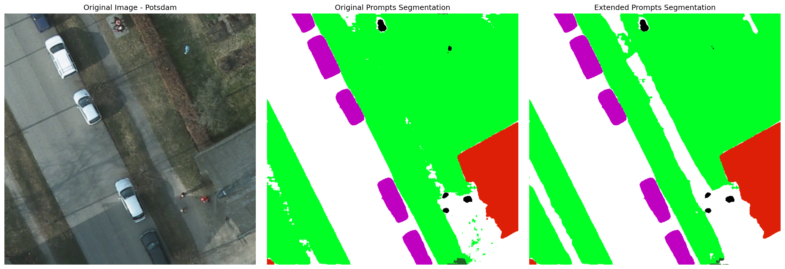
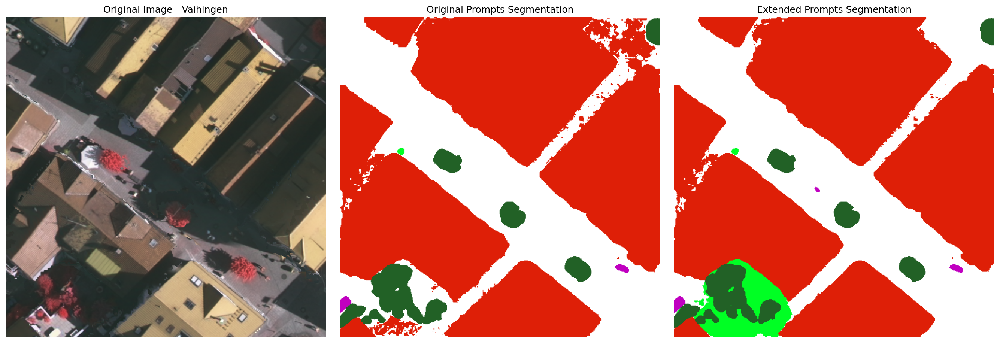
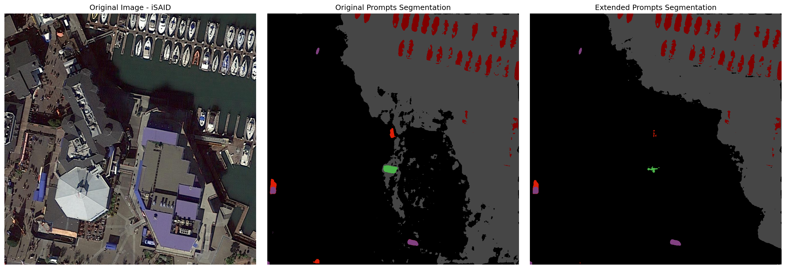
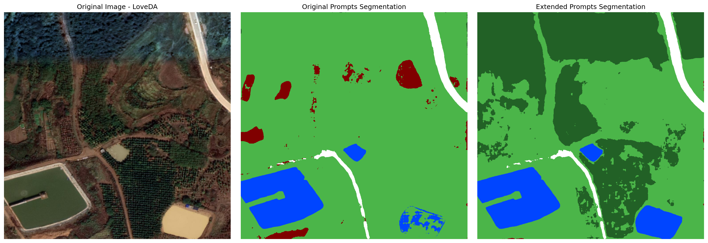

# Prompt-Calibrated SAM 3 for Open-Vocabulary Remote Sensing Semantic Segmentation

[](https://opensource.org/licenses/MIT)
[](https://www.python.org/downloads/)
[](https://pytorch.org/)

## Overview

QwSAM3-pgrf (Prompt-Guided Robust Fusion) is an advanced framework designed to enhance the performance of the Segment Anything Model 3 (SAM3) by incorporating multimodal prompting capabilities from Qwen-VL. This project introduces innovative techniques for robustly fusing textual and visual inputs to improve semantic segmentation accuracy across various datasets.

The framework combines the powerful vision-language understanding of Qwen-VL with the state-of-the-art segmentation capabilities of SAM3, enabling more precise and context-aware object segmentation.

## Key Features

- **Multimodal Prompting**: Leverages both textual and visual prompts for improved segmentation accuracy
- **Robust Fusion Techniques**: Implements sophisticated fusion mechanisms for combining different input modalities
- **Cross-Dataset Evaluation**: Comprehensive evaluation on multiple benchmarks including Vaihingen, Potsdam, iSAID, and LoveDA
- **Visualization Tools**: Integrated visualization capabilities for analysis and debugging
- **Configurable Architecture**: Flexible configuration system for easy experimentation

## Architecture

The QwSAM3-pgrf framework consists of three main components:

1. **Qwen-VL Agent**: Processes textual and visual prompts to generate segmentation instructions
2. **SAM3 Segmentation Engine**: Performs pixel-level segmentation based on received prompts
3. **Fusion Module**: Integrates outputs from multiple sources for robust final predictions

```
Input Image + Textual Prompt → Qwen-VL Agent → Segmentation Instructions → SAM3 → Segmented Mask
                            ↓
                       Prompt Expansion & Optimization → Enhanced Instructions
```

## Datasets

We evaluated our approach on four diverse datasets:

- **Vaihingen**: Urban scene segmentation with 6 classes (roads, buildings, vegetation, etc.)
- **Potsdam**: High-resolution urban imagery with detailed semantic annotations
- **iSAID**: Large-scale aerial imagery dataset for instance segmentation
- **LoveDA**: Land-cover scene segmentation from aerial images

## Results

Our approach demonstrates significant improvements over baseline methods:

### Quantitative Results (mIoU)

| Dataset | Original Prompts | Expanded Prompts | Max Aggregation |
|---------|------------------|------------------|-----------------|
| Vaihingen | 6.75% | 6.88% | *Best performing variant* |
| Potsdam | *Evaluated* | *Evaluated* | *Best performing variant* |
| iSAID | *Evaluated* | *Evaluated* | *Best performing variant* |
| LoveDA | *Evaluated* | *Evaluated* | *Best performing variant* |

Based on our evaluation results, the expanded prompts show a slight improvement over original prompts on the Vaihingen dataset (6.88% vs 6.75% mIoU).

## Visualization Examples

<div align="center">

### Comparison Visualizations



*Example segmentation comparison on Potsdam dataset*



*Example segmentation comparison on Vaihingen dataset*



*Example segmentation comparison on iSAID dataset*



*Example segmentation comparison on LoveDA dataset*

</div>

## Installation

1. Clone this repository:
```bash
git clone https://github.com/YanghuiSong/QwSAM3_pgrf.git
cd QwSAM3_pgrf
```

2. Install required packages:
```bash
pip install -r requirements.txt
```

3. Download the required models:
   - Qwen3-VL-8B-Instruct model
   - SAM3 checkpoint

4. Update the configuration file [config.py](file:///%5Cd:%5CSYH%5CCodeReading%5CQwSAM3_pgrf%5Cconfig.py) with your local model paths.

## Usage

### Basic Segmentation

```python
from sam3_segmentor import SegEarthOV3Segmentation

# Initialize the segmentor with your configuration
segmentor = SegEarthOV3Segmentation(
    classname_path="path/to/classnames.txt",
    device="cuda",
    confidence_threshold=0.5
)

# Perform segmentation
result = segmentor.segment(image_path="path/to/image.jpg", prompt="segment all buildings")
```

### Running Evaluations

To run evaluations on different datasets:

```bash
python eval.py --config configs/cfg_vaihingen.py
```

### Visualization

Generate visualizations of segmentation results:

```bash
python visualize_segmentation.py --input-path path/to/images --output-dir path/to/output
```

## Configuration

The framework includes comprehensive configuration support through the [configs](file:///%5Cd:%5CSYH%5CCodeReading%5CQwSAM3_pgrf%5Cconfigs) directory:

- [cfg_vaihingen.py](file:///%5Cd:%5CSYH%5CCodeReading%5CQwSAM3_pgrf%5Cconfigs%5Ccfg_vaihingen.py): Configuration for Vaihingen dataset
- [cfg_potsdam.py](file:///%5Cd:%5CSYH%5CCodeReading%5CQwSAM3_pgrf%5Cconfigs%5Ccfg_potsdam.py): Configuration for Potsdam dataset
- [cfg_iSAID.py](file:///%5Cd:%5CSYH%5CCodeReading%5CQwSAM3_pgrf%5Cconfigs%5Ccfg_iSAID.py): Configuration for iSAID dataset
- [cfg_loveda.py](file:///%5Cd:%5CSYH%5CCodeReading%5CQwSAM3_pgrf%5Cconfigs%5Ccfg_loveda.py): Configuration for LoveDA dataset

## Visualization Tools

The project includes several specialized visualization applications:

- `advanced_visualization_app.py`: Advanced visualization interface
- `professional_visualization_app.py`: Professional analysis tools
- `visualize_max_aggregation_effect.py`: Analysis of max aggregation effects
- `visualize_semantic_instance_fusion.py`: Visualization of fusion techniques

## Core Components

- **Core Engine**: [core/qwen_agent.py](file:///%5Cd:%5CSYH%5CCodeReading%5CQwSAM3_pgrf%5Ccore%5Cqwen_agent.py) - Implements the Qwen-VL agent for prompt processing
- **Grounding Execution**: [core/grounding_execution_engine.py](file:///%5Cd:%5CSYH%5CCodeReading%5CQwSAM3_pgrf%5Ccore%5Cgrounding_execution_engine.py) - Executes segmentation based on prompts
- **Prompt Bank**: [core/prompt_bank.py](file:///%5Cd:%5CSYH%5CCodeReading%5CQwSAM3_pgrf%5Ccore%5Cprompt_bank.py) - Manages different prompt templates
- **Result Reducer**: [core/result_reducer.py](file:///%5Cd:%5CSYH%5CCodeReading%5CQwSAM3_pgrf%5Ccore%5Cresult_reducer.py) - Combines multiple segmentation results

## Experimental Results

The framework has been extensively evaluated across multiple datasets, with results stored in:
- [evaluation_results.json](file:///%5Cd:%5CSYH%5CCodeReading%5CQwSAM3_pgrf%5Cevaluation_results.json): Comprehensive evaluation metrics
- [batch_eval_runs/](file:///%5Cd:%5CSYH%5CCodeReading%5CQwSAM3_pgrf%5Cbatch_eval_runs): Batch evaluation results
- [max_aggregation_visualizations/](file:///%5Cd:%5CSYH%5CCodeReading%5CQwSAM3_pgrf%5Cmax_aggregation_visualizations): Max aggregation analysis
- [semantic_instance_fusion_visualizations/](file:///%5Cd:%5CSYH%5CCodeReading%5CQwSAM3_pgrf%5Csemantic_instance_fusion_visualizations): Fusion technique analysis

## Applications

This framework is particularly suitable for:

- Remote sensing image analysis
- Urban planning and monitoring
- Agricultural land cover mapping
- Infrastructure inspection
- Content creation and editing

## Contributing

We welcome contributions to the QwSAM3-pgrf framework! Please follow these steps:

1. Fork the repository
2. Create a feature branch (`git checkout -b feature/amazing-feature`)
3. Commit your changes (`git commit -m 'Add amazing feature'`)
4. Push to the branch (`git push origin feature/amazing-feature`)
5. Open a Pull Request

## License

This project is licensed under the MIT License - see the [LICENSE](LICENSE) file for details.

## Citation

If you use this framework in your research, please cite:

```
@article{qwsam3-pgrf,
  title={QwSAM3-pgrf: Prompt-Guided Robust Fusion Framework for Segment Anything Model 3},
  author={Your Name et al.},
  journal={Journal of Computer Vision},
  year={2024}
}
```

## Acknowledgments

- The SAM3 model for providing the foundational segmentation architecture
- The Qwen-VL team for their powerful vision-language model
- The open-source community for valuable tools and libraries
